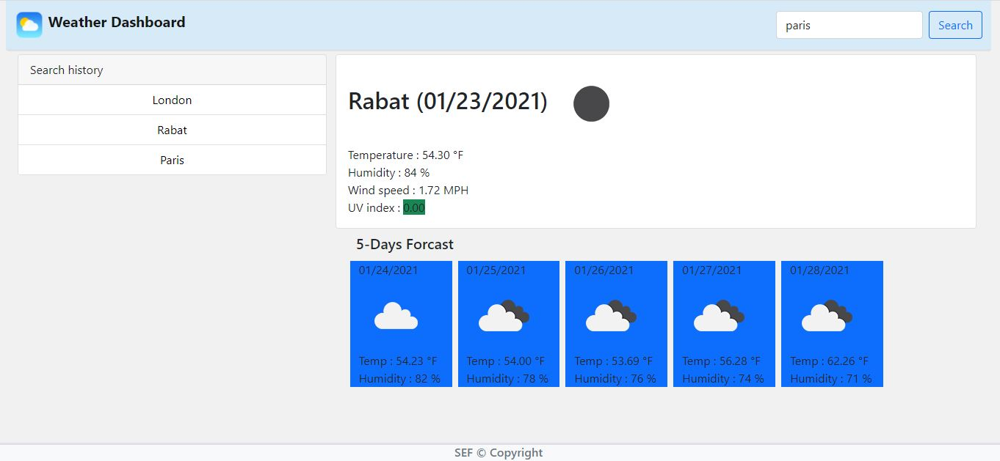

# Weather_Dashboard_SEF
-----------------------------------------------------------------------------------------------------------------------
Table of content :

1. The purpose
2. The method
3. HTML file
4. Bootsrap framework
5. JQuery file
6. API database
7. Demonstration
8. URLs 

-----------------------------------------------------------------------------------------------------------------------

## 1. The purpose :

The main purpose of this project is  to build a weather dashboard that will run in the browser and feature dynamically updated HTML and CSS.

-----------------------------------------------------------------------------------------------------------------------

## 2. The method : 

    This website is created using the following languages, libraries and software.

    * HTML files : index.html.
    * JQuery file: script.js
    * Bootstrap
    * moment.js library
    * OpenWeather API
    * JSON
    * VS Code
    * Github
   

-----------------------------------------------------------------------------------------------------------------------

## 3. HTML file : 
    
    This file is created according to the standards.

    * Using sementics
    * Using consistently indentation and spacing
    * Using links to link the HTML file to other files (JQuery files)
    * Using external links to link the HTML file to Bootstrap, moment.js and JQuery
    * Commenting the code

-----------------------------------------------------------------------------------------------------------------------

## 4. Bootsrap framework : 

This open-source framework is used to style the website and make it reponsive. 

    The main Bootsrap components used in this website are :

    * Grid-system : container, rows and columns (.container, .row, .col)
    * Responsive grid: .col-md
    * Margin and padding : .m, .p, .ms, .mt, .me, .mb
    * float : float-end, float-start
    * Navigation bar : .navbar
    * Form : .form-group, .form-row
    * Card : .card, .card-header, card-body
    * Button : .btn

-----------------------------------------------------------------------------------------------------------------------

## 5. JQuery file : 

This file is used to create a dynamic website using functions to create a simple calendar.

    The main JQuery properties and methods used in this website are :
    
    * Functions : creating new functions [ createButtons(), displaySearchHistory(), displayContent(), UVIScale(), addTooltip(), displayForcast(response), oneCallAPIfunction(response, F, wind, humidity, APIKey), forecastAPIfunction()]
    * HTML DOM : .ready() Method, .on() Method, .each() Method, localStorage.setItem() Method,localStorage.getItem() Method, .text() Method, .val() Method, .attr() Method, .append() Method,
    .css() Method, .addClass() Method, .empty() Method
    * Conditions : if statements
    * JSON Methods : .stringify() Method, .parse Method
    * moment.js library : moment().format(),  moment().add().format()

-----------------------------------------------------------------------------------------------------------------------

## 6. API database : 

The API interface used for this project is the OpenWeather API : 

* Call 5 day / 3 hour forecast data : "https://api.openweathermap.org/data/2.5/forecast?q={city name}&appid={API key}"
* Current and forecast weather data : "https://api.openweathermap.org/data/2.5/onecall?lat={lat}&lon={lon}&exclude={part}&appid={API key}"

-----------------------------------------------------------------------------------------------------------------------
## 7. Demonstration :

-----------------------------------------------------------------------------------------------------------------------

## 8. URLs

* The URL of the deployed application : https://saadiaelf.github.io/Weather_Dashboard_SEF/

* The URL of the GitHub repository: https://github.com/SaadiaELF/Weather_Dashboard_SEF.git

-----------------------------------------------------------------------------------------------------------------------
